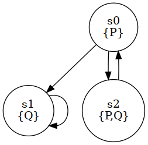

# CITREELO

This is a basic [ROBDD](https://en.wikipedia.org/wiki/Binary_decision_diagram)-based [symbolic model checker](https://en.wikipedia.org/wiki/Model_checking#Symbolic_model_checking) for [Computational Tree Logic](https://en.wikipedia.org/wiki/Computation_tree_logic).

This work started as an interpretation of [the presentation of CTL symbolic model checking from the course of Roberto Sebastiani](http://disi.unitn.it/rseba/DIDATTICA/fm2024/SLIDES/06-SymbolicMc_handouts.pdf).

I use [biodivine-lib-bdd](https://github.com/sybila/biodivine-lib-bdd) as a backend for the [ROBDDs](https://en.wikipedia.org/wiki/Binary_decision_diagram).

The supported [CTL](https://en.wikipedia.org/wiki/Computation_tree_logic) operators are:
- &, |, !, =>, <=>, AX, EX, AF, EF, AG, EG, AU, EU

To compute BDDs representing sets of states satisfying CTL formulae, all these operators directly correspond to operations on BDDs i.e., we do not use translation using a minimal set of operators e.g. "AX p -> !EX(!p)".

## Concrete syntax

Formulae are written with the usual operator precedences, so that e.g. `AG (p => EF q)` needs no further parenthesizing.
From weakest to strongest binding:

| level          | operators                                             | associativity |
|----------------|-------------------------------------------------------|---------------|
| 1 (weakest)    | `<=>`                                                 | left          |
| 2              | `=>`                                                  | right         |
| 3              | `\|`                                                  | left          |
| 4              | `&`                                                   | left          |
| 5              | `!`, `AX`, `EX`, `AF`, `EF`, `AG`, `EG`               | prefix        |
| 6 (strongest)  | atoms, `true`, `false`, `(φ)`, `A[φ U ψ]`, `E[φ U ψ]` |               |

The prefix operators chain (`AG EF p`, `!AX !p`) and bind tighter than the binary connectives: `AX p & q` reads as `(AX p) & q`.
The until operators use the bracket notation `A[φ U ψ]` / `E[φ U ψ]`, where φ and ψ are full formulae.

The names of the atomic propositions are defined by the user (by implementing the `CtlFormulaParser` trait); keywords are matched up to a word boundary, so an atom whose name merely starts with a keyword (e.g. `AXE`) is not shadowed.

Use `parse_complete_ctl_formula` to parse a formula: it consumes the whole input and reports syntax errors with their position, rather than silently accepting a prefix of the formula.


## Example

Let us consider the following Kripke structure given the set of atomic propositions AP={P,Q}



We have three states:
- s0 on which only P holds
- s1 on which only Q holds
- s2 on which both P and Q hold

Given a CTL formula built over AP, one can determine the subset of {s0,s1,s2} on which the formula holds.

For instance we have:
``` 
p             => {s0,s2},
!p            => {s1},
q             => {s1,s2},
!q            => {s0},
p&q           => {s2},
p|q           => {s0,s1,s2},
(!p)&(!q)     => {},
(!p)|(!q)     => {s0,s1},
// ***
EX(p)         => {s0,s2},
EX(q)         => {s0,s1},
EX(p&q)       => {s0},
EX(p&(!q))    => {s2},
EX((!p)&(!q)) => {},
// ***
AX(p)         => {s2},
AX(q)         => {s0,s1},
AX(q&(!p))    => {s1},
AX(p&(!q))    => {s2},
AX(p&q)       => {},
``` 

